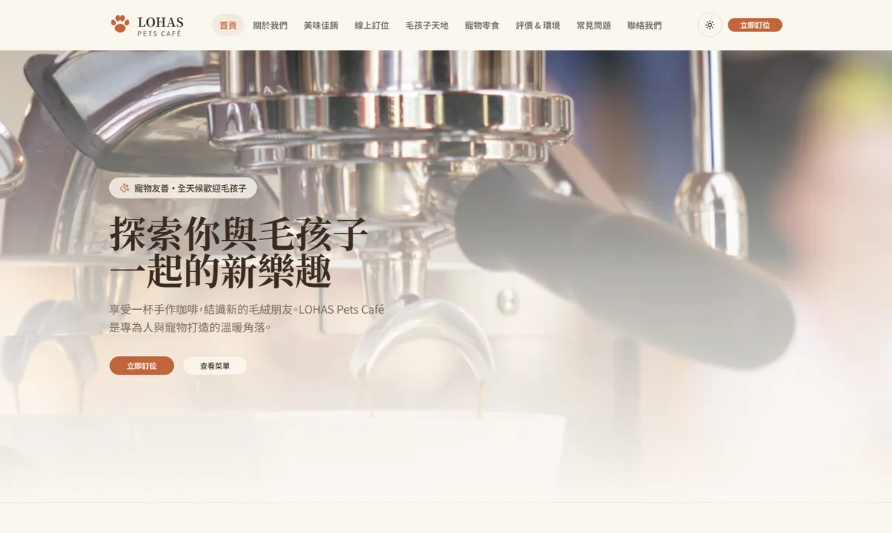
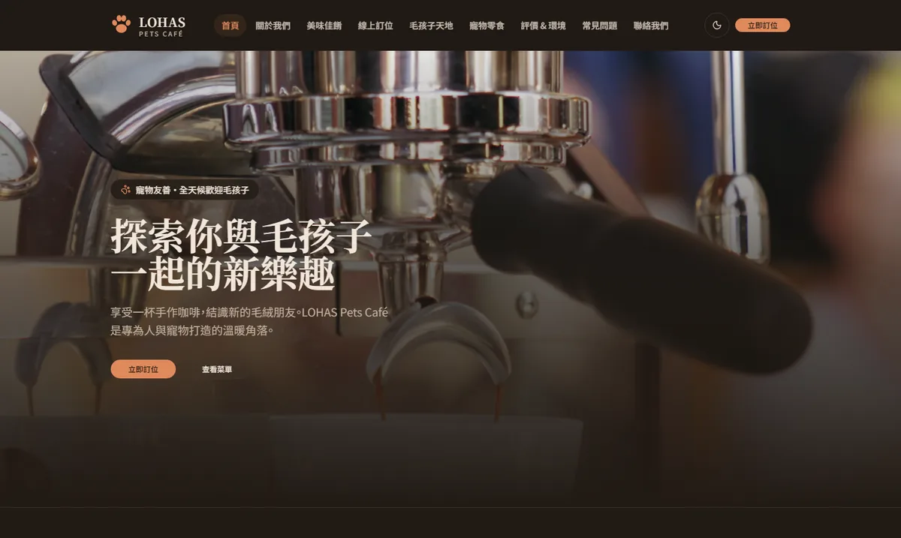
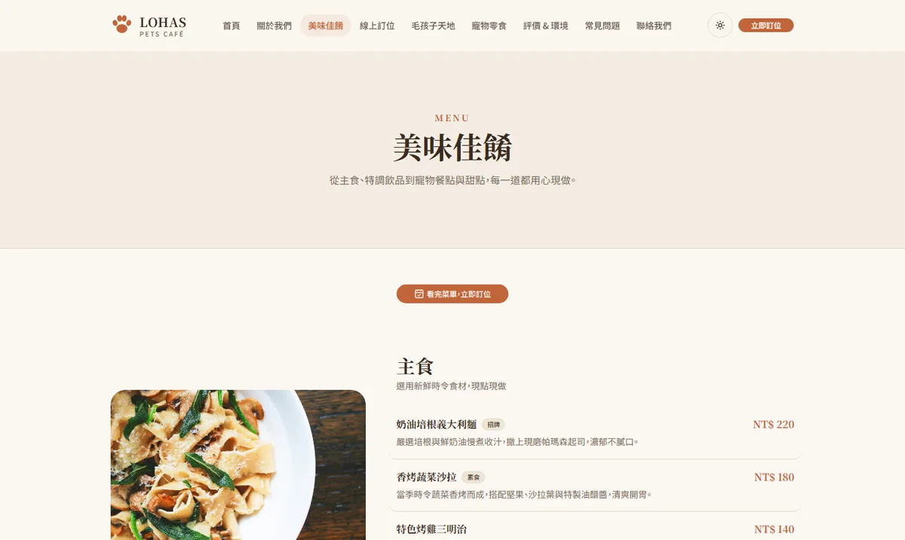
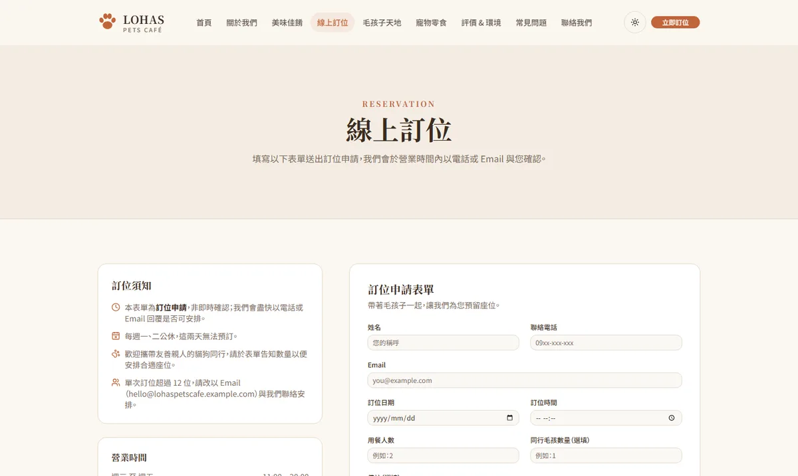
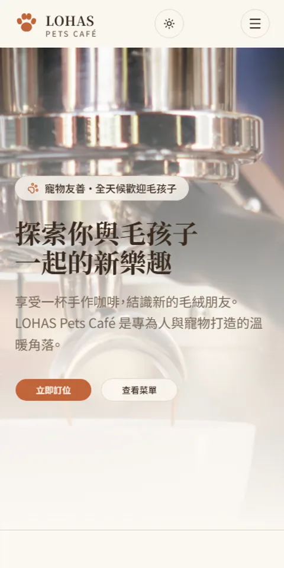

# LOHAS Pets Café ‧ 樂活寵物咖啡廳

[](https://github.com/lemoncat0817/lohas-pets-cafe/actions/workflows/deploy.yml)


LOHAS Pets Café 是一個以寵物友善咖啡廳為主題的品牌形象網站，提供菜單、店寵介紹、環境展示與線上訂位等功能。

**🔗 Demo：https://lemoncat0817.github.io/lohas-pets-cafe/**

## 預覽

| 首頁（亮色） | 首頁（深色） |
| :---: | :---: |
|  |  |

| 完整菜單 | 線上訂位 |
| :---: | :---: |
|  |  |

<details>
<summary>手機版首頁</summary>



</details>

## 功能

| 頁面 | 說明 |
| --- | --- |
| `/` 首頁 | Hero 氛圍影片、品牌價值、精選菜單、店寵預覽、五星評價輪播 |
| `/about` 關於我們 | 品牌創立故事、經營理念、主理人介紹 |
| `/menu` 完整菜單 | 分類價目表（真實 HTML 資料，非烘在圖片裡），含 Menu 結構化資料 |
| `/reservation` 線上訂位 | 訂位申請表單，自動擋公休日與非營業時段 |
| `/pets` 毛孩子天地 | 店貓店犬介紹卡 |
| `/shop` 寵物零食 | 商品卡（原價／特價、成分說明） |
| `/gallery` 評價與環境 | 用餐環境相簿、顧客評價輪播，含 Review／AggregateRating 結構化資料 |
| `/faq` 常見問題 | 手風琴式常見問題 |
| `/contact` 聯絡我們 | 地址地圖、營業時間、聯絡表單 |

## 技術棧

- **框架**：Nuxt 4（TypeScript strict，`nuxi generate` 靜態產生多頁面）
- **樣式**：Tailwind CSS v4
- **元件庫**：[shadcn-vue](https://www.shadcn-vue.com/)（基於 [Reka UI](https://reka-ui.com/)，元件原始碼位於 `app/components/ui`）
- **主題**：@nuxtjs/color-mode，亮／深色模式即時切換，並同步瀏覽器原生控制項的 `color-scheme`
- **轉場**：Nuxt `experimental.viewTransition`，Chromium 原生頁面切換動畫，其餘瀏覽器優雅降級
- **圖示**：@nuxt/icon（Iconify / Lucide）
- **字型**：@nuxt/fonts 自架 Noto Serif TC / Noto Sans TC
- **圖片**：@nuxt/image（WebP 多尺寸最佳化）
- **表單**：vee-validate + zod，共用 `useWeb3Form` composable 送出至 [Web3Forms](https://web3forms.com/)
- **SEO**：@nuxtjs/seo（每頁 meta、sitemap、robots、Restaurant／Menu／Review 結構化資料）

## 快速開始

需要 Node.js 22+ 與 pnpm。

```sh
# 安裝依賴
pnpm install

# 開發模式
pnpm dev

# 靜態產生（輸出於 .output/public，可部署到任何靜態託管服務）
pnpm generate

# 本地預覽靜態產出
pnpm preview

# Lint
pnpm lint
```
