# LOHAS Pets Café ‧ 樂活寵物咖啡廳

[](https://github.com/lemoncat0817/lohas-pets-cafe/actions/workflows/deploy.yml)


LOHAS Pets Café 是一個以寵物友善咖啡廳為主題的品牌形象網站，提供菜單、店寵介紹、環境展示與線上訂位等功能。

**線上版本：[lemoncat0817.github.io/lohas-pets-cafe](https://lemoncat0817.github.io/lohas-pets-cafe/)**

<picture>
  <source media="(prefers-color-scheme: dark)" srcset="./docs/screenshots/01-home-dark.webp">
  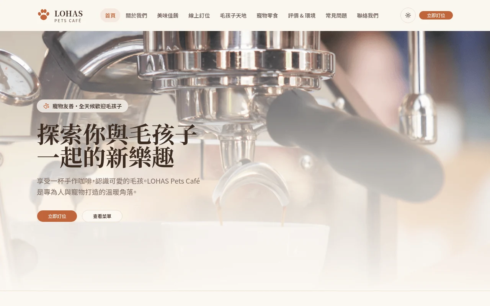
</picture>

## 畫面預覽

### 品牌形象與雙模式切換

支援亮色（暖陽木質調）與深色（沉靜深夜咖啡館）模式無縫切換，包含動態氛圍 Hero 影片、品牌核心精神、熱門餐點推薦與營業資訊展示。

| 首頁（亮色模式） | 首頁（深色模式） |
| :---: | :---: |
|  | 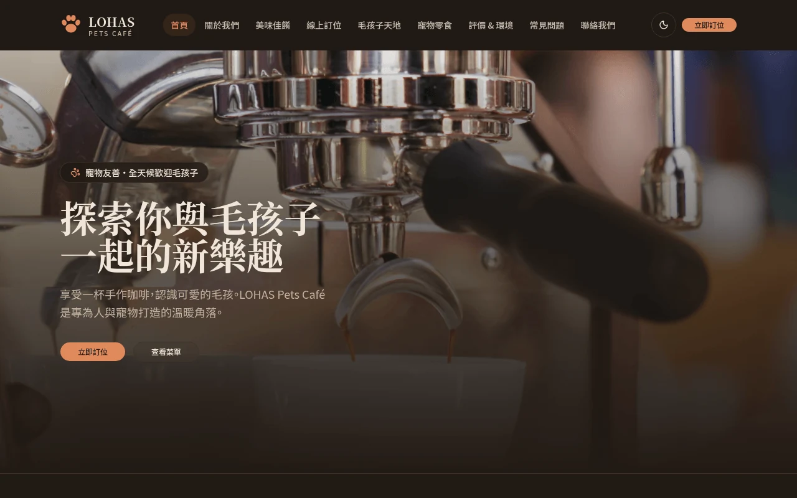 |

### 精選菜單與寵物特餐

提供主食料理、義式手沖、精緻輕食與甜點分類價目，並獨家設計寵物專屬無鹽無調味健康鮮食，清楚標示人氣招牌、素食與成分細節。

| 美味佳餚分類價目表 | 毛孩專屬鮮食料理點心 |
| :---: | :---: |
| 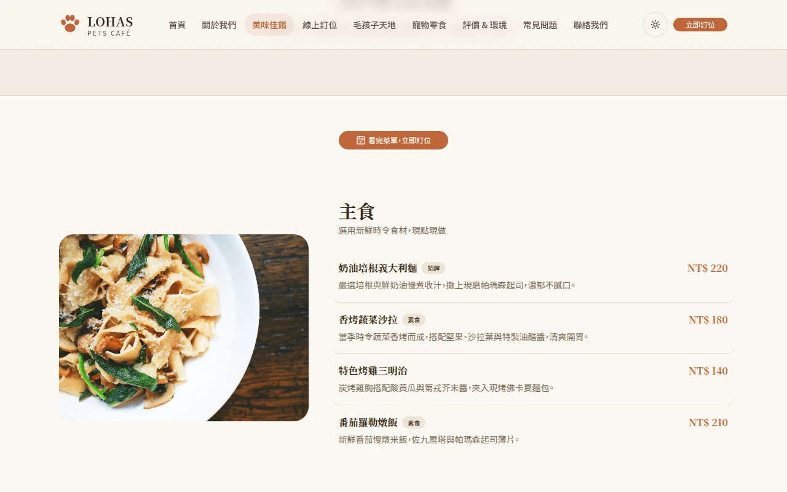 | 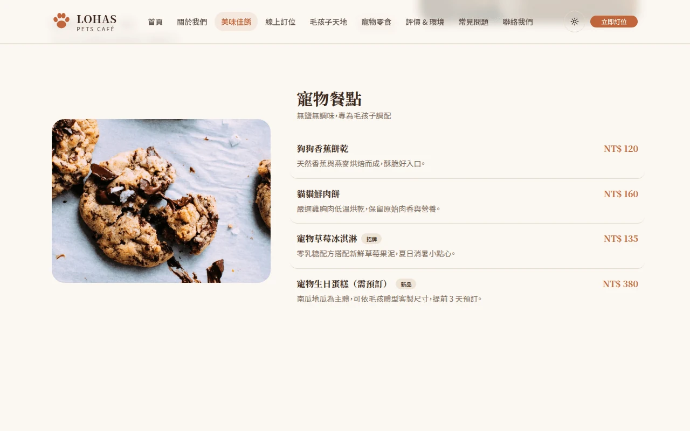 |

### 線上訂位與營業時段驗證

提供直覺的線上預約系統，整合用餐人數、毛孩同行數量與特殊需求備註；內建 Zod + VeeValidate 即時檢核公休日（週一、週二）與營業時間防呆。

| 線上訂位申請表單 | 即時規則防呆與公休檢核 |
| :---: | :---: |
| 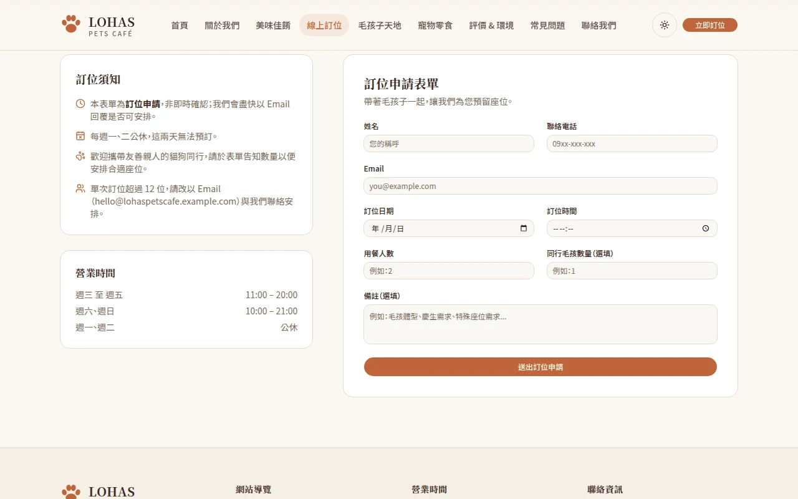 | 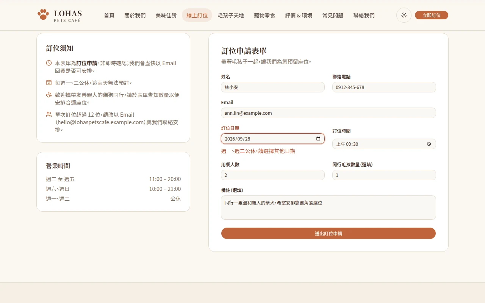 |

### 毛孩子天地與常駐店寵

完整展示常駐店貓與店犬的年齡、品種與職位標籤（迎賓隊長、窗邊曬太陽組長、陪伴大使、毛線球巡邏員），並貼心附上個性特質與親人互動說明。

| 店貓店犬群體檔案（亮色） | 店貓店犬群體檔案（深色） |
| :---: | :---: |
| 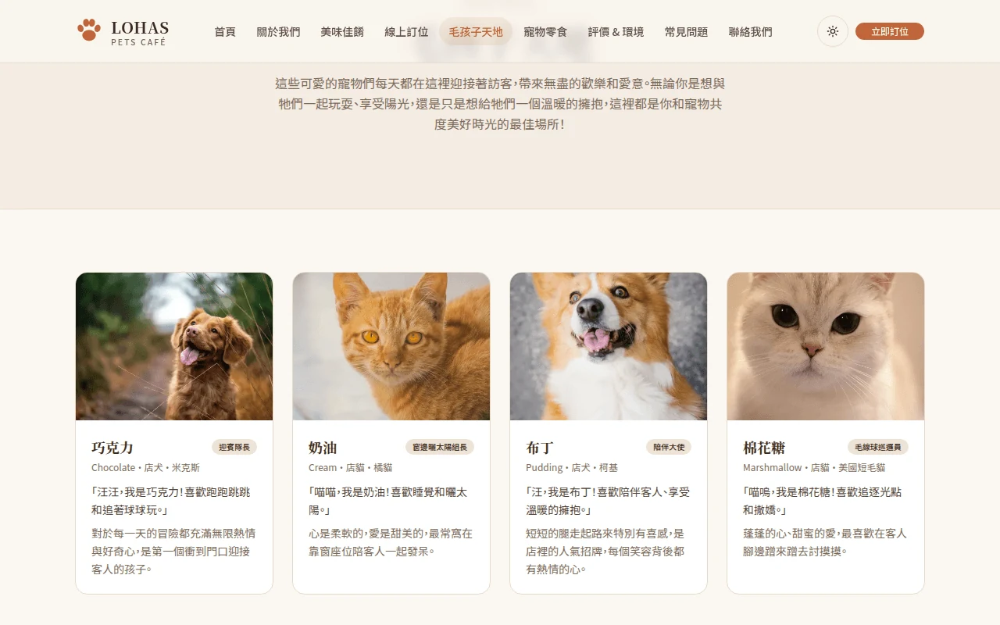 | 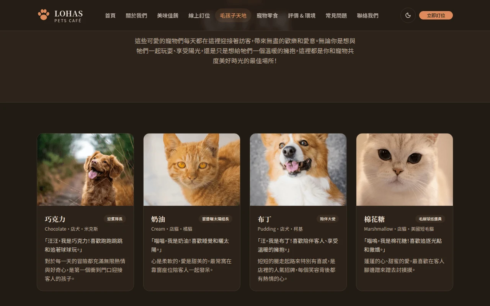 |

### 用餐環境相簿與顧客評價

呈現採光通透的溫馨室內用餐區、落地窗景與毛孩遊樂角落；整合真實飼主五星用餐心得輪播，並具備 Review 與 AggregateRating 結構化資料。

| 用餐環境相簿藝廊 | 五星好評與用餐心得 |
| :---: | :---: |
| 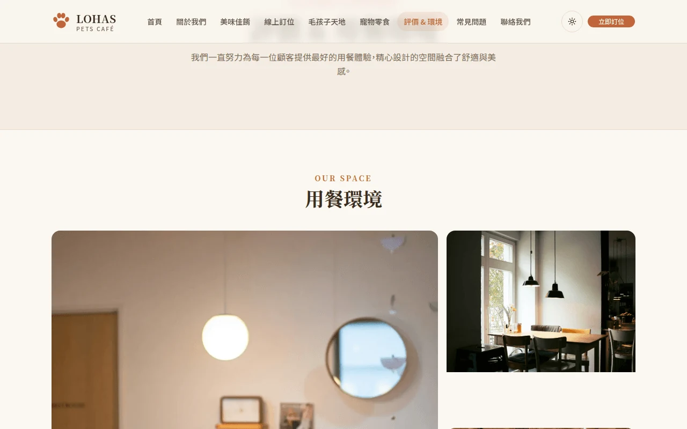 |  |

### 寵物選品與手風琴常見問答

嚴選天然手作烘焙肉乾、凍乾與成分標示，為毛孩把關健康；手風琴常見問題詳細解說攜帶寵物入內牽繩規定、訂位原則、店內衛生與慶生包場服務。

| 天然手作寵物零食選品 | 手風琴常見問題（FAQ） |
| :---: | :---: |
| 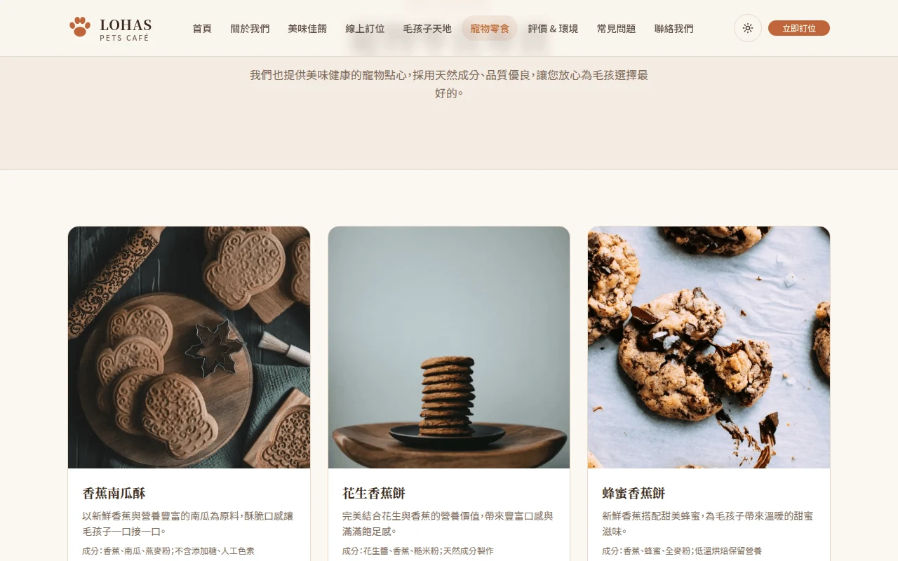 | 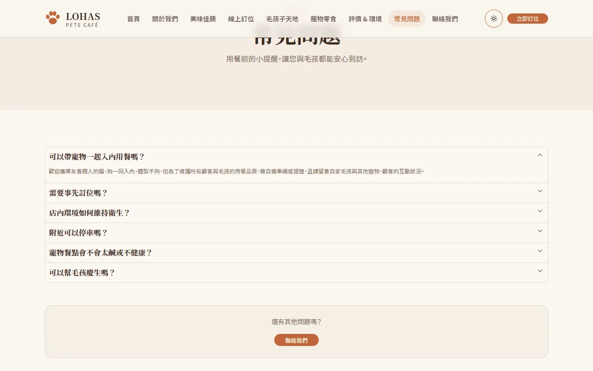 |

### 品牌故事與店長理念

講述一群愛動物的朋友因咖啡聚會而創立 LOHAS Pets Café 的歷程；由店長「檸檬貓」分享創立初衷與堅持打造人寵共好空間的心路歷程。

| 品牌創立故事（Our Story） | 店長理念與初衷（店長的話） |
| :---: | :---: |
| 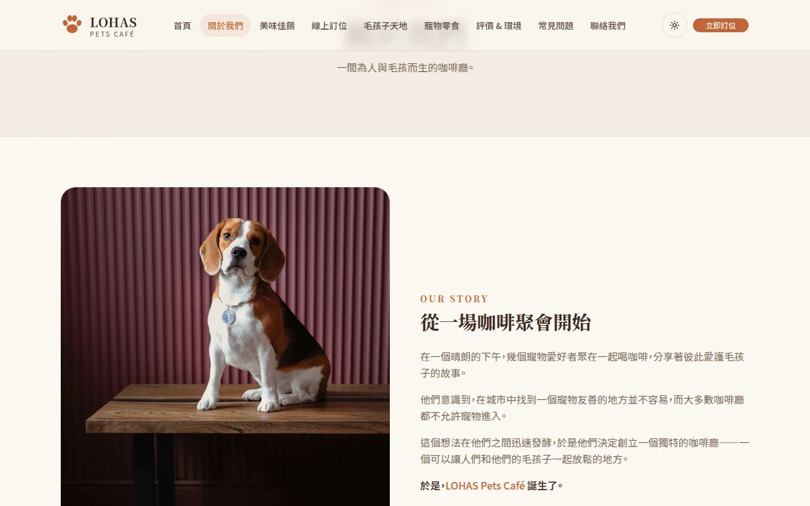 | 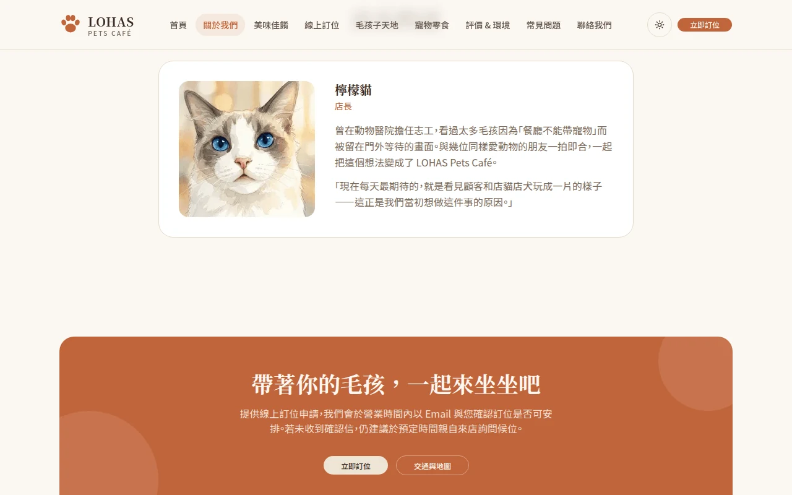 |

### 門市資訊與線上諮詢

提供完整門市地址、大眾捷運與步行指引、各日營業時段，並嵌入 Google 互動地圖與 Web3Forms 線上即時問題諮詢表單。

| 門市資訊與交通指引地圖 | 線上即時諮詢表單（深色） |
| :---: | :---: |
| 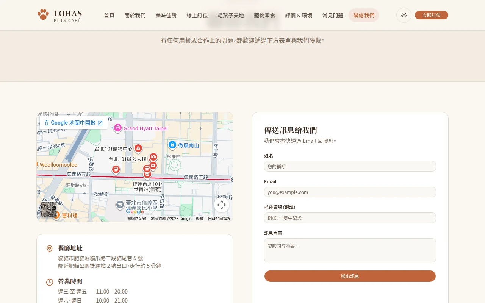 | 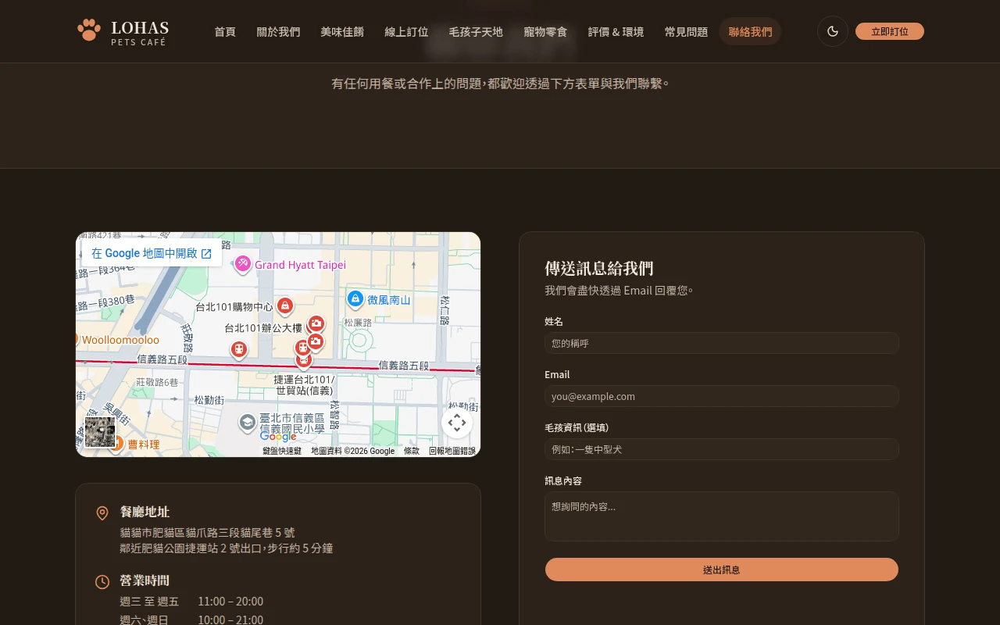 |

### 行動裝置自適應體驗（RWD）

針對行動裝置進行全方位響應式設計（RWD），提供流暢的單手滑動瀏覽、全螢幕自適應排版與側邊抽屜式導航選單。

| 手機版首頁瀏覽 | 手機版側邊選單抽屜 |
| :---: | :---: |
| 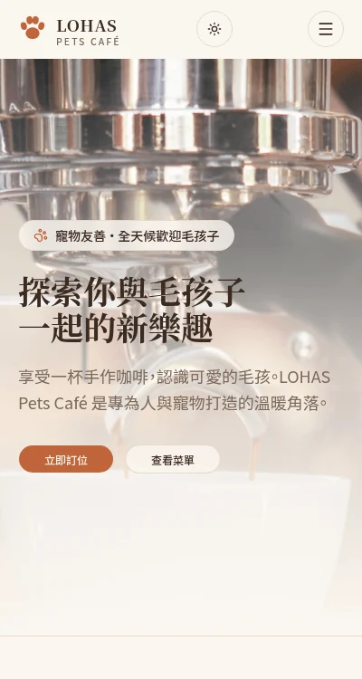 | 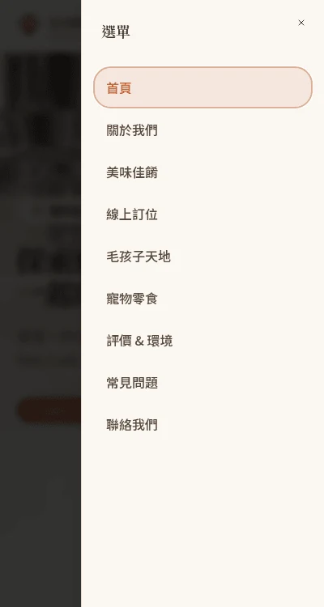 |

## 功能

| 頁面 | 說明 |
| --- | --- |
| `/` 首頁 | Hero 氛圍影片、品牌價值、精選菜單、店寵預覽、五星評價輪播 |
| `/about` 關於我們 | 品牌創立故事、經營理念、店長介紹 |
| `/menu` 完整菜單 | 分類價目表（真實 HTML 資料，非烘在圖片裡），含 Menu 結構化資料 |
| `/reservation` 線上訂位 | 訂位申請表單，自動擋公休日與非營業時段 |
| `/pets` 毛孩子天地 | 店貓店犬介紹卡 |
| `/shop` 寵物零食 | 商品卡（原價／特價、成分說明） |
| `/gallery` 評價與環境 | 用餐環境相簿、顧客評價輪播，含 Review／AggregateRating 結構化資料 |
| `/faq` 常見問題 | 手風琴式常見問題 |
| `/contact` 聯絡我們 | 地址地圖、營業時間、聯絡表單 |

## 技術棧

- **框架**：Nuxt 4（TypeScript strict，`nuxi generate` 靜態產生多頁面）
- **樣式**：Tailwind CSS v4
- **元件庫**：[shadcn-vue](https://www.shadcn-vue.com/)（基於 [Reka UI](https://reka-ui.com/)，元件原始碼位於 `app/components/ui`）
- **主題**：@nuxtjs/color-mode，亮／深色模式即時切換，並同步瀏覽器原生控制項的 `color-scheme`
- **轉場**：Nuxt `experimental.viewTransition`，Chromium 原生頁面切換動畫，其餘瀏覽器優雅降級
- **圖示**：@nuxt/icon（Iconify / Lucide）
- **字型**：@nuxt/fonts 自架 Noto Serif TC / Noto Sans TC
- **圖片**：@nuxt/image（WebP 多尺寸最佳化）
- **表單**：vee-validate + zod，共用 `useWeb3Form` composable 送出至 [Web3Forms](https://web3forms.com/)
- **SEO**：@nuxtjs/seo（每頁 meta、sitemap、robots、Restaurant／Menu／Review 結構化資料）

## 快速開始

需要 Node.js 22+ 與 pnpm。

```sh
# 安裝依賴
pnpm install

# 開發模式
pnpm dev

# 靜態產生（輸出於 .output/public，可部署到任何靜態託管服務）
pnpm generate

# 本地預覽靜態產出
pnpm preview

# Lint
pnpm lint
```
